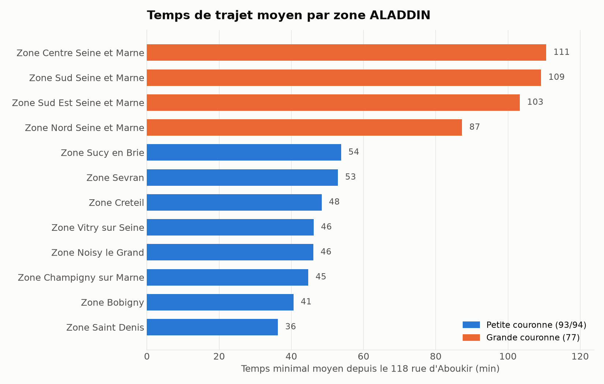
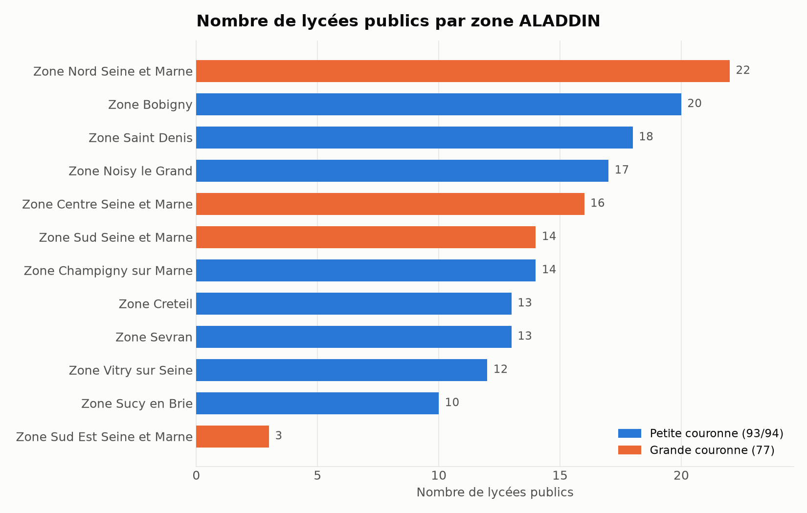
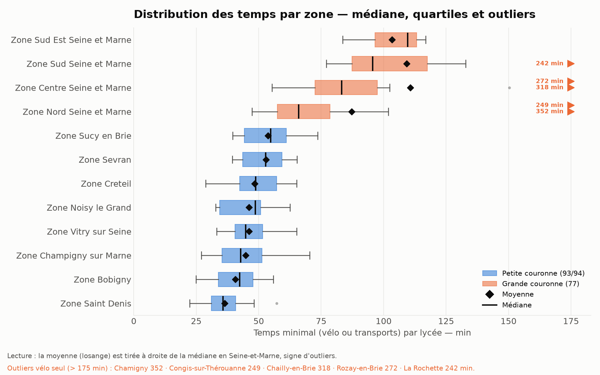
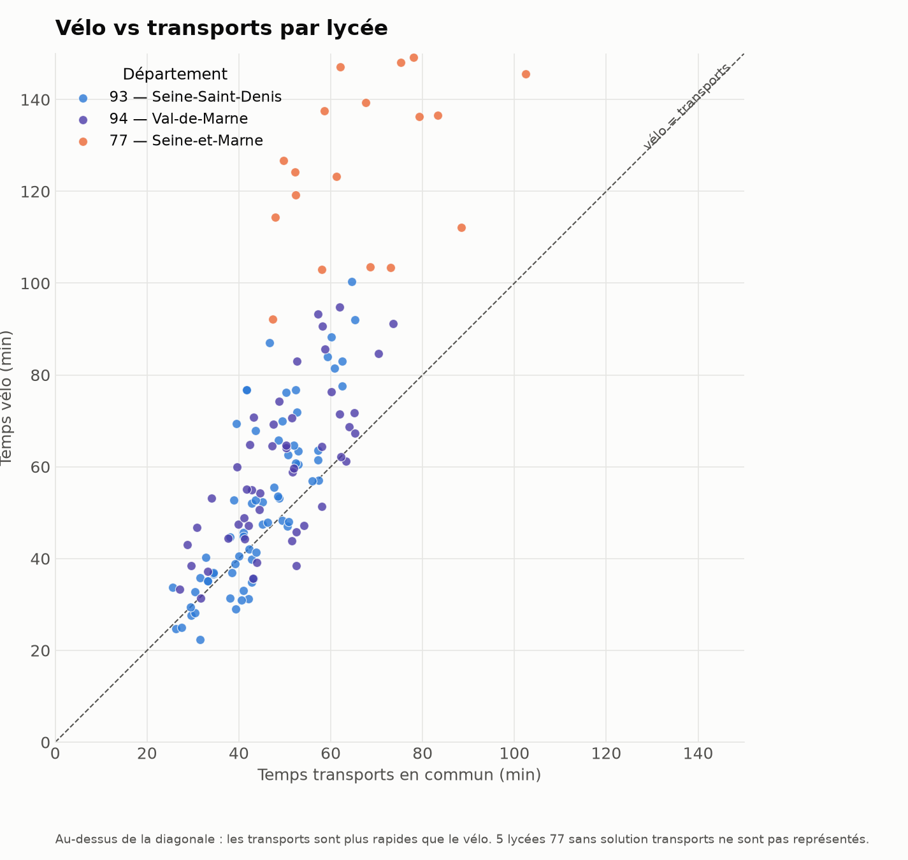

# Lycées publics de l'académie de Créteil — temps de trajet depuis le 118 rue d'Aboukir

Analyse des temps de trajet (**vélo** et **transports en commun**) entre le
**118 rue d'Aboukir, 75002 Paris** et chaque **lycée public de l'académie de
Créteil**, puis agrégation par **zone géographique ALADDIN**.

Origine géocodée (Base Adresse Nationale) : `48.868771, 2.350606`.

---

## TL;DR

- **172 lycées** publics dans l'académie de Créteil (dép. **77** : 55 · **93** : 68 · **94** : 49).
- Temps calculés via **deux API PRIM Île-de-France Mobilités distinctes** :
  🚲 **Geovelo** (172/172) et 🚇 **Navitia** (167/172).
- Colonne **`temps_min`** = `min(vélo, transports)` par lycée.
- **Petite couronne (93/94)** : ~35–55 min. **Grande couronne (77)** : nettement plus,
  et surtout **très dispersée** (voir la section outliers).
- 5 lycées de Seine-et-Marne (46–59 km) n'ont **aucune solution transports** depuis
  Paris → leur `min` retombe sur un long trajet vélo (**outliers** à traiter).

---

## Résultats par zone

Nombre de lycées et **moyenne du temps min** par zone (tri croissant) :





| zone | nb lycées | moyenne | médiane | min | max |
|------|-----------|---------|---------|-----|-----|
| Zone Saint Denis | 18 | 36.3 | 35.7 | 22.3 | 57.2 |
| Zone Bobigny | 20 | 40.6 | 42.3 | 25.0 | 55.9 |
| Zone Champigny sur Marne | 14 | 44.7 | 42.8 | 27.1 | 70.4 |
| Zone Noisy le Grand | 17 | 46.1 | 48.7 | 32.8 | 62.5 |
| Zone Vitry sur Seine | 12 | 46.2 | 44.8 | 33.2 | 65.2 |
| Zone Creteil | 13 | 48.4 | 48.8 | 28.7 | 65.1 |
| Zone Sevran | 13 | 52.9 | 52.8 | 39.4 | 65.3 |
| Zone Sucy en Brie | 10 | 53.8 | 54.8 | 39.6 | 73.6 |
| Zone Nord Seine et Marne | 22 | **87.3** | 66.0 | 47.4 | **352.0** |
| Zone Sud Est Seine et Marne | 3 | 103.3 | 109.6 | 83.6 | 116.8 |
| Zone Sud Seine et Marne | 14 | 109.2 | 95.6 | 77.0 | 242.2 |
| Zone Centre Seine et Marne | 16 | 110.6 | 83.2 | 55.3 | 318.1 |

*(temps en minutes ; données complètes dans `data/agg_by_zone.csv`)*

---

## Le problème des outliers

Dans les zones de **grande couronne (77)**, la **moyenne est trompeuse** : quelques
lycées très éloignés sans solution transports (chiffrés en vélo seul, 240–352 min)
tirent la moyenne bien au-dessus de la médiane. Les boîtes à moustaches le rendent
visible — le **losange (moyenne)** est décalé à droite du **trait (médiane)**, et
les outliers sont flaggés au bord droit :



Exemples parlants :
- **Zone Centre Seine et Marne** : moyenne **110.6** min mais médiane **83.2** min
  (outlier : Chailly-en-Brie 318 min).
- **Zone Nord Seine et Marne** : moyenne **87.3** min mais médiane **66.0** min
  (outlier : Chamigny 352 min).

👉 Pour comparer les zones équitablement, la **médiane** est plus robuste que la
moyenne. Les 5 outliers correspondent aux lycées 77 sans desserte TC depuis Paris.

---

## Vélo vs transports

Pour la quasi-totalité des lycées, les **transports battent le vélo** (points
au-dessus de la diagonale), l'écart se creusant avec la distance (points 77 en haut) :



---

## Méthodologie

### Données source
- Jeu **[Lycées – données générales](https://www.data.gouv.fr/datasets/lycees-donnees-generales)**
  (ressource `74dbd738-7724-4f85-9776-1e2d38fb2284`, GeoJSON).
- Filtre : `statut = public` **et** `academie = Créteil` → 172 établissements.

### Deux API PRIM Île-de-France Mobilités
| Mode | API | Requête | Durée dans |
|------|-----|---------|-----------|
| 🚲 Vélo | **Geovelo** | `POST /marketplace/computedroutes` — headers `apikey`, `Source: prim` ; corps JSON `waypoints` + `bikeDetails` | `route.duration` (s) |
| 🚇 Transports | **Navitia** | `GET /marketplace/v2/navitia/journeys?from=lon;lat&to=lon;lat` — header `apikey` | `min(journeys[].duration)` (s) |

### Mapping commune → zone (ALADDIN)
Les 12 zones et leurs communes proviennent de
[aladdin.ac-creteil.fr](https://aladdin.ac-creteil.fr/aladdin/voeux/liste_zones.php)
(contenu dans `data/zones_source.txt`). 3 communes accueillant un lycée mais non
listées individuellement (Chailly-en-Brie, La Rochette, Saint-Mammès) ont été
rattachées à la zone de leur lycée classé le plus proche (1,6–4,4 km), conforme au
découpage de la carte des zones.

---

## Reproduire

```bash
pip install pandas requests matplotlib
export PRIM_API_KEY="votre_cle_api_prim"   # clé jamais committée (lue dans l'env)
python3 build_lycees.py        # -> data/lycees_creteil_public.csv
python3 compute_times.py       # -> data/lycees_with_times.csv (appels API PRIM)
python3 parse_zones.py         # -> data/zones_mapping.csv
python3 aggregate.py           # -> data/agg_by_{zone,commune,departement}.csv
python3 make_visualisations.py # -> viz/*.png
```

## Arborescence
```
build_lycees.py  compute_times.py  parse_zones.py  aggregate.py  make_visualisations.py
data/  lycees_with_times.csv (dataframe complet) · agg_by_zone.csv · agg_by_commune.csv
       agg_by_departement.csv · zones_mapping.csv · zones_source.txt · lycees_raw.geojson
viz/   zone_avg_time.png · zone_count.png · zone_boxplot.png · bike_vs_transport.png
LEARNINGS.md  — enseignements techniques du projet
```

Colonnes de `data/lycees_with_times.csv` : `…, lat, lon, velo_temps_s,
transport_temps_s, velo_temps_min, transport_temps_min, temps_min_s,
temps_min_min, zone`.
