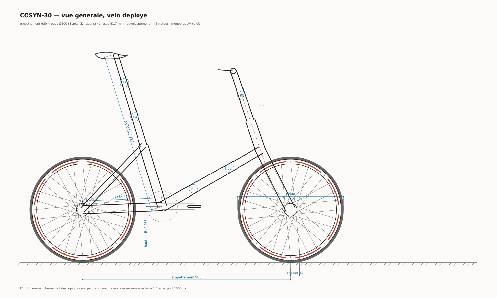

# COSYN-30 — vélo pliant transportable en sac à dos 30 L

Étude complète d'un vélo pliant à roues déployables tenant dans le volume utile
d'un sac à dos 30 L compact : conception, plans cotés, vérification
structurelle par éléments finis, bilan de masse et vérification d'encombrement.



## Le vélo en une page

| | |
|---|---|
| Roues | **Ø 500 mm déployables** — jante en 8 arcs sur cordon captif, 32 rayons tendus à 700 N par came |
| Cadre | monopoutre télescopique 3 étages, **monobras avant et arrière** |
| Empattement / chasse | 980 mm / 41,7 mm — angle de direction 71° |
| Transmission | mono-vitesse 34 × 12, développement 4,45 m/tour |
| Freins | 2 disques mécaniques Ø140 |
| Suspension | élastomère 30 mm avant et arrière |
| **Masse** | **8,43 kg ± 0,20** (aluminium) · **7,94 kg** (variante carbone) |
| **Volume replié** | **10,1 L de matière**, occupe 486 × 282 × 174 mm dans un sac 30 L |
| Montage | ≈ 2 min 30, sans outil, 5 verrouillages contrôlables |
| Durée de vie estimée | 13 000 km (cumul de Miner sur spectre de service) |

## Dossier

| Document | Contenu |
|---|---|
| [00 — Cahier des charges](docs/00-cahier-des-charges.md) | exigences, coefficients de sécurité, synthèse des résultats |
| [01 — Architecture](docs/01-architecture-et-choix.md) | étude comparative des roues, bandage vs pneumatique, monobras, télescopes |
| [02 — Étude structurelle](docs/02-etude-structurelle.md) | méthode, 8 cas de charge du cadre, raideurs, emmanchements |
| [03 — Roue déployable](docs/03-roue-deployable.md) | définition, 6 cas de charge, état des joints, mécanisme de tension |
| [04 — Masse et encombrement](docs/04-masse-et-encombrement.md) | nomenclature chiffrée, leviers d'allègement, vérification de rangement |
| [05 — Montage, fiabilité, essais](docs/05-montage-fiabilite-essais.md) | procédure, captivité, fatigue sur spectre, AMDEC, plan d'essais |
| [06 — Limites et suite](docs/06-limites-et-suite.md) | ce qui n'est pas tenu, risques, prochaines étapes |

## Plans

| Plan | |
|---|---|
| [01 — Vue générale](plans/01-vue-generale.svg) | vélo déployé, coté |
| [02 — Roue déployable](plans/02-roue-deployable.svg) | vue de face, coupe de jante, tenon conique, moyeu, séquence de montage |
| [03 — Emmanchement télescopique](plans/03-emmanchement-telescopique.svg) | coupe de l'expandeur conique |
| [04 — Plan de rangement](plans/04-plan-de-rangement.svg) | implantation vérifiée dans le sac, définition de la mousse de calage |

Tous les plans sont **générés depuis le paramétrage** (`calc/c08_plans.py`) :
aucun trait n'est dessiné à la main, une modification de cote régénère des
plans exacts.

## Calculs

```bash
cd calc
python3 test_fem.py    # validation du solveur EF sur 7 cas analytiques
python3 run_all.py     # chaîne complète -> ../out/rapport-calculs.txt
```

| Module | Rôle |
|---|---|
| `fem.py` | solveur éléments finis poutres 3D (12 ddl) + barres précontraintes tension-only |
| `test_fem.py` | validation analytique — écart max 1,9 × 10⁻¹⁴ |
| `params.py` | **source unique de vérité** : matériaux, géométrie, cas de charge, courbe de Wöhler |
| `joints.py` | modèle des emmanchements télescopiques (matage, jeu, expandeur) |
| `c02_cadre.py` | modèle EF du cadre, 8 cas de charge, raideurs |
| `c03_roue.py` | modèle EF de la roue, enveloppe de phase, flambement d'anneau, mécanisme de tension |
| `c04_telescopes.py` | dimensionnement des emmanchements sur enveloppe d'efforts |
| `c05_masses.py` | nomenclature et propagation d'incertitude |
| `c06_encombrement.py` | voxelisation 6 mm et rangement par meilleur ajustement |
| `c07_fatigue.py` | cumul de Miner sur spectre de service |
| `c08_plans.py` | génération des plans SVG |

Sorties dans `out/` : `rapport-calculs.txt` (rapport intégral) et un JSON par
étude.

## Trois résultats à retenir

1. **Le concept de roue est structurellement sain, pas un compromis.** La
   précontrainte des rayons met la jante en compression circonférentielle
   (3 510 N) ; les huit joints restent intégralement comprimés dans tous les cas
   de charge, avec 12,9 MPa de contrainte minimale au plus défavorable. Un
   tenon conique en compression pure est une liaison fiable.

2. **Le meilleur levier de la roue ne coûte rien en masse.** Un insert rapporté
   au siège de rayon (K<sub>t</sub> 1,8 au lieu de 2,5 sur perçage brut) réduit
   la contrainte locale de 28 % — davantage que 8 rayons supplémentaires ou
   4 mm de hauteur de jante.

3. **L'objectif de 8 kg n'est pas atteignable en aluminium.** 8,43 kg, soit
   426 g de trop, avec 1 % de probabilité de tenir compte tenu des
   incertitudes. Il l'est en composite (7,94 kg). Le dossier le dit plutôt que
   de rogner les coefficients de sécurité.
