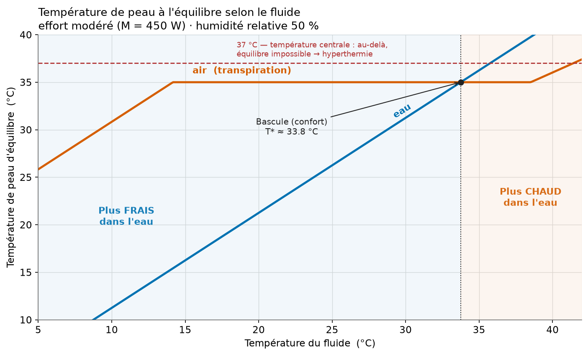
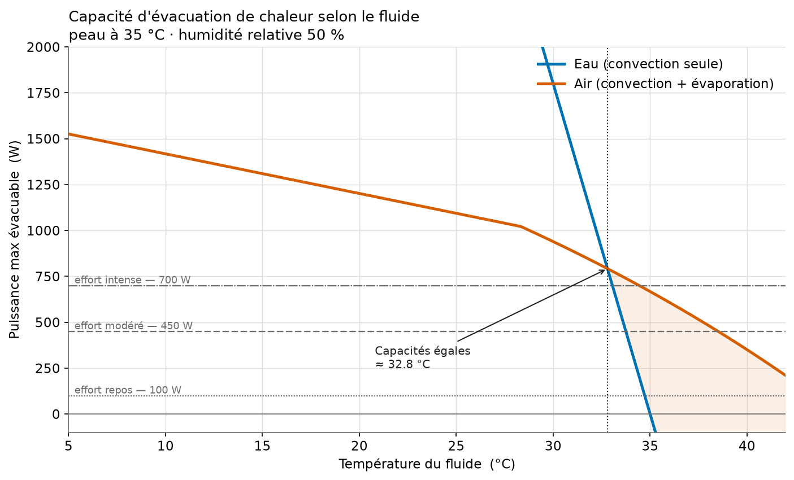
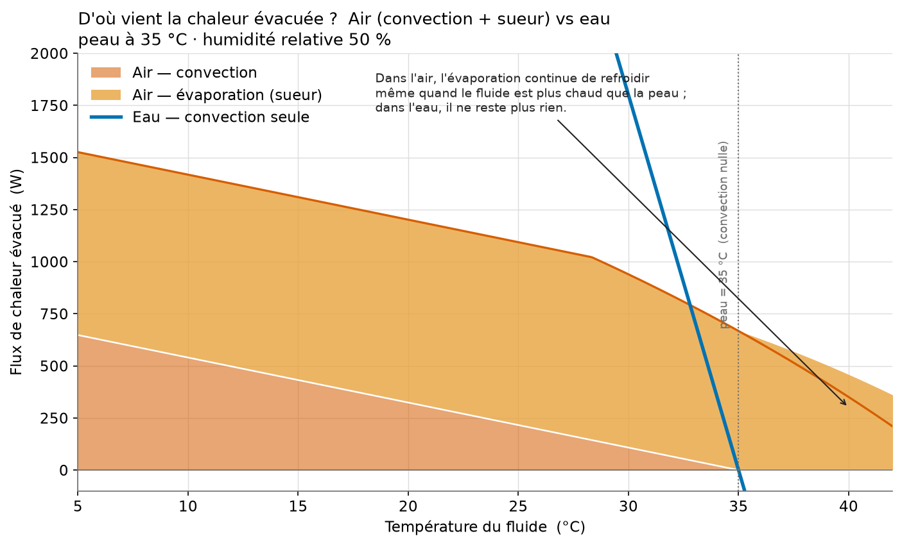
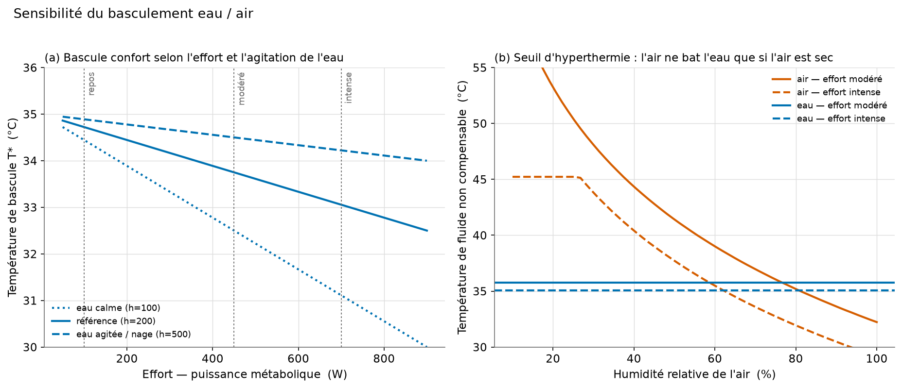

# À effort égal, à partir de quelle température a-t-on plus chaud dans l'eau que dans l'air ?

> **La question d'Étienne**
>
> « À effort physique égal, si tu le produis dans l'eau ou dans l'air :
> le coefficient de transfert conducto-convectif est bien plus fort dans l'eau,
> donc quand le fluide est froid, tu te refroidis plus dans l'eau que dans l'air
> *(fait 1)*. Mais dans l'air tu peux transpirer et évacuer de la chaleur par
> évaporation, alors que dans l'eau non *(fait 2)*.
> **Du coup, à partir de quelle température du fluide as-tu plus chaud dans l'eau
> que dans l'air ?** »

## Réponse courte

Il y a **deux seuils**, pas un :

| Seuil | Effort modéré (~450 W) | Ce qui se passe |
|---|---|---|
| **Bascule « confort »** `T*` | **≈ 33–34 °C** | En dessous, la peau est plus fraîche dans l'eau ; au-dessus, elle est plus chaude dans l'eau. |
| **Seuil d'hyperthermie** (eau) | **≈ 35–36 °C** | Au-dessus, dans l'eau, le corps ne peut **plus du tout** évacuer sa chaleur → la température centrale monte. Dans l'air, on tient bien plus longtemps grâce à la sueur. |

**En une phrase :** dès que le fluide dépasse ~**34 °C**, l'eau cesse d'être
l'endroit le plus frais et, passé ~**35–36 °C**, elle devient carrément
dangereuse à l'effort — *tant que l'air reste sec*. Le point clé est là :
**l'avantage de l'air, c'est la transpiration, et cet avantage s'effondre quand
l'air est humide.** À 80 % d'humidité et effort intense, l'air redevient même
*pire* que l'eau (voir fig. 4b).

---

## Les deux faits physiques (confirmés par le modèle)

**Fait 1 — l'eau échange beaucoup plus vite.**
Le coefficient d'échange conducto-convectif de l'eau autour d'un corps
(~100–500 W·m⁻²·K⁻¹) est **~15 à 40 fois** celui de l'air (~8–15 W·m⁻²·K⁻¹, rayonnement inclus).
À écart de température égal, on perd donc beaucoup plus de chaleur dans l'eau.
C'est pour ça qu'une eau à 25 °C paraît fraîche alors qu'un air à 25 °C est
agréable, et qu'on meurt d'hypothermie en quelques heures dans une eau à 15 °C.

**Fait 2 — seul l'air permet l'évaporation.**
Immergé, on ne peut pas transpirer utilement : la sueur ne s'évapore pas.
Il ne reste que la convection, dont la puissance `h·A·(T_peau − T_fluide)`
tombe à **zéro** quand le fluide atteint la température de peau (~35 °C), puis
devient un **apport** de chaleur au-delà.
Dans l'air, l'évaporation de la sueur évacue une chaleur latente qui ne dépend
**pas** de l'écart de température mais de l'écart de **pression de vapeur**
(donc de l'humidité). Ce mécanisme continue de refroidir même quand l'air est
*plus chaud* que la peau.

---

## Le modèle

Bilan thermique en régime permanent (modèle « une masse »). À un effort donné,
le corps produit une puissance métabolique `M` (chaleur) qu'il doit dissiper.

**Dans l'eau** (pas d'évaporation) :

```
M = h_eau · A · (T_peau − T_fluide)      ⟹   T_peau = T_fluide + M/(h_eau·A)
```

**Dans l'air** (convection + rayonnement + évaporation régulée par la sueur) :

```
M = h_air · A · (T_peau − T_air)  +  E
E = min( h_e · A · [p_sat(T_peau) − HR · p_sat(T_air)] ,  E_max_sueur )
```

où `p_sat` est la pression de vapeur saturante (formule de Magnus), `h_e` le
coefficient évaporatif (relation de Lewis, `h_e ≈ 16,5·h_conv`), et `E_max_sueur`
le plafond physiologique de sudation (~0,9 kW pour ~1,3 L/h).

Le corps régule : il transpire pour **maintenir une peau « confortable »
(~35 °C)** tant que c'est possible ; quand la sueur sature, la peau doit monter,
et si elle dépasse la température centrale (**37 °C**), l'équilibre devient
**impossible** → hyperthermie.

**Point de bascule « confort »** (régime où l'air compense en transpirant, peau tenue à `T_set`) :

```
T* = T_set − M/(h_eau·A)
```

C'est-à-dire : la température d'eau pour laquelle la peau dans l'eau
(`T_fluide + M/(h_eau·A)`) rejoint la consigne tenue dans l'air (`T_set`).

### Paramètres de référence

| Paramètre | Valeur | Source / remarque |
|---|---|---|
| Surface corporelle `A` | 1,8 m² | formule de DuBois |
| `h_eau` | 200 W·m⁻²·K⁻¹ | corps immergé, eau calme (100–500 selon agitation) |
| `h_air` | 12 W·m⁻²·K⁻¹ | convection (~8) + rayonnement (~4) |
| `h_e` | ≈ 132 W·m⁻²·kPa⁻¹ | relation de Lewis |
| `E_max_sueur` | ≈ 880 W | ~1,3 L/h × 2 430 kJ/kg |
| `T_set` peau | 35 °C | consigne de confort |
| `T_centrale` | 37 °C | plafond de la température de peau |
| Effort modéré `M` | 450 W | course/vélo modéré (repos 100, intense 700) |
| Humidité relative | 50 % | valeur de référence |

---

## Résultats

### 1. Température de peau à l'équilibre — la réponse directe



La droite « eau » suit le fluide presque au degré près (`+1,25 °C` seulement,
car `h_eau` est énorme). La courbe « air » forme un **plateau à 35 °C** : sur
une large plage, le corps encaisse en transpirant plus ou moins.
Les deux courbes se croisent en **`T* ≈ 33,8 °C`** :

- **fluide < 34 °C** → peau plus **fraîche dans l'eau** (fait 1 : l'eau évacue mieux) ;
- **fluide > 34 °C** → peau plus **chaude dans l'eau**, et l'eau franchit la
  ligne des 37 °C dès ~35,8 °C (hyperthermie), pendant que l'air reste régulé.

### 2. Capacité maximale d'évacuation



À froid, l'eau évacue des **kilowatts** (la droite bleue explose vers le haut) :
aucun problème pour dissiper l'effort — le risque est l'inverse, se refroidir trop.
Mais la capacité de l'eau **chute linéairement** et **s'annule à 35 °C**, puis
devient négative. L'air, lui, garde un « plancher » évaporatif :
en croisant les lignes d'effort horizontales, on lit la température de fluide
maximale supportable pour chaque intensité.

### 3. D'où vient la chaleur évacuée ?



Décomposition du flux dans l'air : la part **convective** (orange foncé) fond
jusqu'à zéro à 35 °C, exactement comme la seule arme de l'eau (courbe bleue).
Ce qui sauve l'air au-delà, c'est **l'évaporation** (ambre), qui reste
importante et refroidit encore quand le fluide est plus chaud que la peau.
Dans l'eau, à ce moment-là, **il ne reste plus rien**.

### 4. Sensibilité : effort, agitation, et surtout humidité



- **(a)** Plus l'effort est élevé, plus la bascule `T*` arrive tôt (l'eau devient
  pénalisante plus vite). Une eau **agitée** (nage, courant → `h_eau` élevé)
  rapproche encore `T*` de la température de peau.
- **(b)** **Le facteur décisif est l'humidité.** Le seuil d'hyperthermie de l'eau
  (bleu) est **indépendant de l'humidité** (~35–36 °C). Celui de l'air (orange)
  s'effondre quand l'air devient humide : au-delà de ~**77 %** (modéré) ou
  ~**62 %** (intense) d'humidité, **l'air devient pire que l'eau**. En air sec,
  au contraire, on tolère des températures très élevées (sauna à 45–55 °C).

---

## Synthèse numérique

**Bascule « confort »** `T* = T_set − M/(h_eau·A)` :

| Effort | `M` | `T*` |
|---|---|---|
| Repos | 100 W | ≈ 34,7 °C |
| Modéré | 450 W | ≈ 33,8 °C |
| Intense | 700 W | ≈ 33,1 °C |

**Seuil d'hyperthermie** (température de fluide au-delà de laquelle l'effort
n'est plus compensable) :

| Effort | Eau | Air sec (20 %) | Air humide (80 %) |
|---|---|---|---|
| Repos | 36,7 °C | 59 °C | 39 °C |
| Modéré | 35,8 °C | 53 °C | 35 °C |
| Intense | 35,1 °C | 45 °C | 32 °C |

Lecture : en air sec l'écart est énorme (l'air gagne largement) ; en air très
humide, l'avantage disparaît et peut s'inverser.

---

## Limites du modèle

- Modèle **une masse** en **régime permanent** : il ignore l'inertie thermique
  (montée en température du corps) et le gradient cœur/peau détaillé.
- Immersion **totale** supposée ; en pratique on est rarement immergé jusqu'au cou.
- `h_eau` et `h_air` varient fortement avec l'agitation/le vent — d'où l'étude de
  sensibilité (fig. 4). Les valeurs choisies sont des ordres de grandeur usuels.
- Le rayonnement est agrégé dans `h_air` ; négligé dans l'eau.
- La régulation physiologique (vasomotricité, courbe de sudation) est simplifiée
  par une consigne de peau + un plafond de sueur.

Ces simplifications ne changent pas les **ordres de grandeur** ni la structure
de la réponse : deux seuils, autour de **34 °C** (confort) et **35–36 °C**
(danger), fortement modulés par l'humidité côté air.

---

## Reproduire les figures

```bash
pip install matplotlib numpy
python3 analyse/modele_thermique.py
# -> écrit les 4 figures dans analyse/figures/ et affiche la synthèse chiffrée
```
